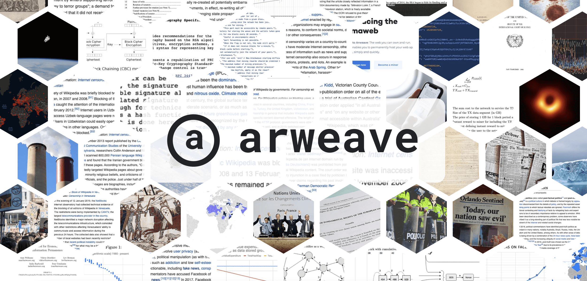

# Awesome Arweave 🐘

> Useful resources for using [Arweave](https://www.arweave.org/) and building things on top of it

_This list is for projects, tools, or pretty much any things related to Arweave that are totally_ **awesome**_. This is for products which are already awesome - if you have plans for cool stuff to do with Arweave, you should build it, and then link it here. If you have an idea for an awesome thing to do with Arweave, a good place to ask about it might be in [our Arweave Community](https://www.arweave.org/get-involved/community)._

## Table of Contents

- [Awesome Arweave 🐘](#awesome-arweave-)
  - [Table of Contents](#table-of-contents)
  - [Official 🐘](#official-)
  - [Apps 🕯️](#apps-️)
  - [Services ⚒️](#services-️)
  - [Tools ⚙️](#tools-️)
  - [Videos 📺](#videos-)
  - [Podcasts 🎙️](#podcasts-️)
  - [Articles 📰](#articles-)

## Official 🐘

- [Website](https://www.arweave.org/)
- [Twitter](https://twitter.com/ArweaveTeam)
- [GitHub](https://github.com/ArweaveTeam)
- [Developer Discord](https://discord.gg/BXk8tq7)
- [Miners Discord](https://discord.gg/GHB4fxVv8B)
- [Arweave Wiki](https://arwiki.wiki/)
- [Arweave Block Explorer](https://viewblock.io/arweave)
- [Arweave News](https://arweave.news/)
- [Whitepaper](https://www.arweave.org/files/arweave-lightpaper.pdf)
- [YellowPaper](https://www.arweave.org/yellow-paper.pdf)

## Apps 🕯️

- [Akord](https://akord.com/) - Permanent blockchain storage for the things that matter most.
- [CrypNote](https://crypnote.io/) - CrypNote is a web3 permanent storage note collaboration product.
- [decent.land](https://decent.land/) - The web3 social layer.
- [DSocial](https://dsocial.app) - Decentralized & censorship resistant 📺 built on InternetComputer & Arweave.
- [Darkblock](https://www.darkblock.io/) - NFT content access controls for the creator economy.
- [Dojima Network](https://www.dojima.network/) - Organizing the Unorganized WEB3.0.
- [EthSign](https://ethsign.xyz/) - The first ever Web3 native agreement signing and execution platform.
- [everFinance](https://everpay.io/) - Real-time financial protocol for the blockchain.
- [glass.xyz](https://glass.xyz/) - Own the future of video. Support creators, join their journey. Unlimited upload size.
- [Mask Network](https://mask.io/) - The Portal to the New, Open Internet.
- [Mirror.xyz](https://mirror.xyz/) - Create and connect your world on web3.
- [Metaweave.xyz](https://metaweave.xyz/) - The public place for arweavers.
- [redstone.finance](https://redstone.finance/) - Powering DeFi
with real-world data.
- [Permacast](https://permacast.net/) - Permacast is the protocol that lets you store your podcasts permanently on Arweave.
- [Papyrus](https://papyrus.so/) - Web3-native newsletters & publishing. We're changing how creators publish, grow & get paid.
- [KYVE Network](https://www.kyve.network/) - A next-generation protocol that enables data providers to seamlessly store and reliably verify their data streams.
- [Koii Network](https://koii.network/) - The attention game has been dominated by a powerful few. Koii is changing things by rewarding creators and developers directly for their content.
- [Kwil](https://kwil.com/) - Kwil is the first decentralized, community owned SQL database solution for building advanced dApps and protocols.
- [Orbis](https://orbis.club/) - Orbis is the crypto native social network built on Ceramic and Arweave.
- [OLTA](https://olta.art/) - A NFT Art Platform for Interactive Experiences.
- [Solanart](https://solanart.io/) - Discover, collect and trade NFTs.
- [Releap](https://beta.releap.io/) - Music NFT platform built on Solana.
- [Verto Exchange](https://www.verto.exchange/) - The first decentralized exchange on the permaweb.
- [Weavemail](https://weavemail.app/) - Private, decentralised and open source mail. [Source](https://github.com/ArweaveTeam/weavemail)

## Services ⚒️

- [ArDrive](https://ardrive.io/) - ArDrive is the app that lets you pay once to securely save your files forever on the Arweave permaweb.
- [Bundlr Network](https://bundlr.network/) - We make permanent data storage easy.
- [Meson Network](https://meson.network/) - Bandwidth trading platform built on blockchain.
- [Media Foundation](https://media.network/) - Media Foundation is a non-profit organization dedicated to the decentralization, growth, and security of Media Network.
- [Pocket Network](https://www.pokt.network/) - Decentralized RPC protocol for ANY blockchain.
- [Spheron Protocol](https://spheron.network/) - Best decentralized cloud storage in 3 clicks.

## Tools ⚙️

- [ArConnect](https://www.arconnect.io/) - 🦔 Secure wallet management for Arweave. [Source](https://github.com/th8ta/ArConnect)
- [arweave-js](https://github.com/ArweaveTeam/arweave-js) - Browser and Nodejs client for general interaction with the arweave protocol and gateways.
- [arweave-php](https://github.com/ArweaveTeam/arweave-php) - This package allows us to interact with the Arweave network, we can use it to read and write transactions and data to the network.
- [SmartWeave](https://github.com/ArweaveTeam/SmartWeave) - Simple, scalable smart contracts on the Arweave protocol.
- [3em](https://github.com/three-em/3em) - A blazingly fast, secure, reliable, multi-language execution machine for Smart Contracts.[Demo](https://3em.dev/)
- [arweave-python-client](https://github.com/MikeHibbert/arweave-python-client) - This client allows you to integrate your python apps with the Arweave network allowing you to perform wallet operations and transactions.
- [arkb](https://github.com/textury/arkb) - Deploy your files to the Arweave network.
- [arweave-nft-uploader](https://github.com/0xEnrico/arweave-nft-uploader) - a Python tool to improve the experience of uploading NFTs to the Arweave storage for use with the Metaplex Candy Machine.
- [goar](https://github.com/everFinance/goar) - Arweave http client and wallet implemented in go, Arweave SDK.
- [did:ar](https://github.com/GlassProtocol/didar) - multi-chain DIDs backed by Arweave.
- [arseeding](https://github.com/everFinance/arseeding) - Lightweight arweave data seed node.
- [arweave-dart](https://github.com/CDDelta/arweave-dart) - Dart package for interfacing with the Arweave network.
- [wAR](https://github.com/KYVENetwork/wAR) - Wrapped AR on Ethereum.
- [argo-react](https://github.com/argoapp-live/argo-react) - One-click deployment service on the top of Arweave.
- [arweave-ipfs-bridge](https://github.com/AndreiD/arweave-ipfs-bridge) - A bridge to connect IPFS to Arweave.
- [ledger-arweave](https://github.com/Zondax/ledger-arweave) - Arweave app for Ledger Nano S and X.
- [arcode](https://github.com/luckyr13/arcode) - Arweave IDE: Smartweave editor and deployer. [Demo](https://arcode.studio/)
- [arweave-json-uploader](https://github.com/narbs91/arweave-json-uploader) - A simple node.js script to upload json data in bulk to the Arweave blockchain from a CSV.
- [arloader](https://github.com/CalebEverett/arloader) - Rust command line application and client for uploading files to Arweave.
- [AS-bridge](https://github.com/developerfred/AS-bridge) - Solana <> Arweave Decentralized Bridge.
- [arweave-swift](https://github.com/lukereichold/arweave-swift) - A lightweight Swift client for the Arweave blockchain.
- [arlocal](https://github.com/textury/arlocal) - Local testnet for your Arweave products.
- [arweave-tools](https://github.com/francesco-adamo/arweave-tools) - A set of useful tools to monitor your Arweave node and gather information quickly.
- [arweave-go](https://github.com/Dev43/arweave-go) - Golang Client to interact with the Arweave Blockchain.
- [arwallet-miner](https://github.com/littledivy/arwallet-miner) - Multi-threaded Arweave wallet miner built on top of OpenSSL.
- [ArweaveApps](https://github.com/cedriking/ArweaveApps) - Permaweb indexer for permaweb apps built on top of Arweave.
- [arweaver](https://github.com/rootmos/arweaver) - An Arweave client written in Rust.
- [Arpomus](https://github.com/kryptopoo/arweave-polygon-music) - a fully decentralized streaming platform with a community of artists, listeners, and developers who collaborate and share music.
- [geomorphs-contract](https://github.com/Dynamiculture/geomorphs-contract) - Hardhat ERC721 with OpenSea Proxies. Uses Arweave to store contract and image metadata.
- [Nordenblog](https://github.com/franzmaliszt/Nordenblog) - A decentralized news sharing application built on Arweave Blockchain.
- [Arweave-stratum-mining-protocol](https://github.com/matpool/Arweave-stratum-mining-protocol) - Arweave stratum mining protocol.
- [arweave-url-shortener](https://github.com/niinpatel/arweave-url-shortener) - URL Shortening website that uses the Arweave Blockchain as backend.
- [ar-im](https://github.com/igastatus/ar-im) - Instant messaging on the Arweave.
- [arweave4s](https://github.com/toknapp/arweave4s) - Light, modular, functional http-client for the Arweave blockchain.

## Videos 📺

- [Get started building on Arweave | 27th July 2021](https://www.youtube.com/watch?v=l8w04ukmF3o) - In this session, Sam Williams shows how easy it is to build on Arweave and gives a brief introduction to deploying on Arweave, SmartWeave contracts, TestWeave, and more! 

## Podcasts 🎙️

- [Permaweb Pioneers: The pathway forward in 2022 for the Arweave ecosystem](https://open.spotify.com/episode/4oyQeX5GYHM0E3A4I66Y7l)
- [Content2049: Uprising Web3 Storage I](https://open.spotify.com/episode/6JO58XwzQaXH6gVUbPvCU6)

## Articles 📰

- [Creating a Permaweb App with Arweave + React](https://arwiki.wiki/#/en/creating-a-dapp) 
- [Meson Network enhance Arweave](https://medium.com/meson-network/meson-enhance-arweave-86c8cabba8f2) 